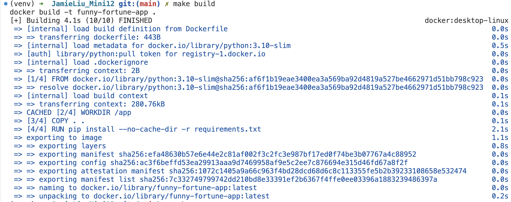

# JamieLiu_Mini12

[](https://github.com/nogibjj/JamieLiu_Mini12/actions/workflows/cicd.yml)

## Funny Fortune App

Welcome to the **Funny Fortune App**, a fun web application that delivers random, quirky "fortune cookie" messages every time you click a button. This project demonstrates how to containerize a Python Flask application using Docker, along with a CI/CD pipeline that builds and pushes the Docker image to Docker Hub.

---

## Project Structure

```
JamieLiu_Mini12/
├── app.py               # Flask application code
├── Dockerfile           # Docker configuration file
├── requirements.txt     # Python dependencies
├── Makefile             # Automation for common tasks
├── .github/
│   └── workflows/
│       └── cicd.yml     # GitHub Actions CI/CD pipeline
├── .gitignore           # Ignore unnecessary files in version control
└── README.md            # Project documentation
```

---

## How It Functions

1. **Funny Fortune App**:

   - A simple Flask application that displays random "fortunes" with each button click.
   - Runs inside a Docker container.

2. **Containerization**:

   - The app is packaged into a Docker image using the `Dockerfile`.
   - All dependencies are installed via `requirements.txt`.

3. **CI/CD Pipeline**:

   - A GitHub Actions workflow automates building the Docker image and pushing it to Docker Hub on every commit to the `main` branch.

4. **Docker Hub Deployment**:
   - The Docker image is hosted on Docker Hub for easy reuse.

---

## How to Use It

### **1. Clone the Repository**

```bash
git clone git@github.com:nogibjj/JamieLiu_Mini12.git
cd JamieLiu_Mini12
```

### **2. Build and Run Locally**

Make sure Docker is installed and running.

1. Build the Docker image:

   ```bash
   make build
   ```

   

2. Run the Docker container:

   ```bash
   make run
   ```

   

3. Access the app at:
   ```
   http://localhost:9000
   ```

---

## Makefile Commands

- **`make build`**:
  Builds the Docker image using the `Dockerfile`.

- **`make run`**:
  Runs the Docker container, exposing port **9000** for the app.

- **`make tag`**:
  Tags the Docker image with your Docker Hub username.

- **`make push`**:
  Pushes the tagged Docker image to Docker Hub (requires Docker Hub login).

- **`make clean`**:
  Stops and removes any running containers and deletes the built Docker image.

---

## Demo Screenshots

1. **Homepage**:
   The initial screen invites users to click the button for their fortune.
   

2. **Fortune Display**:
   A random, funny fortune is displayed after clicking the button.
   

3. **New Fortune**:
   When the button is clicked again, the fortune changes to another random, funny message.
   

---

## CI/CD Pipeline

The GitHub Actions workflow automates the following:

1. Build the Docker image.
2. Push the Docker image to Docker Hub.
   

## Docker Hub Image


